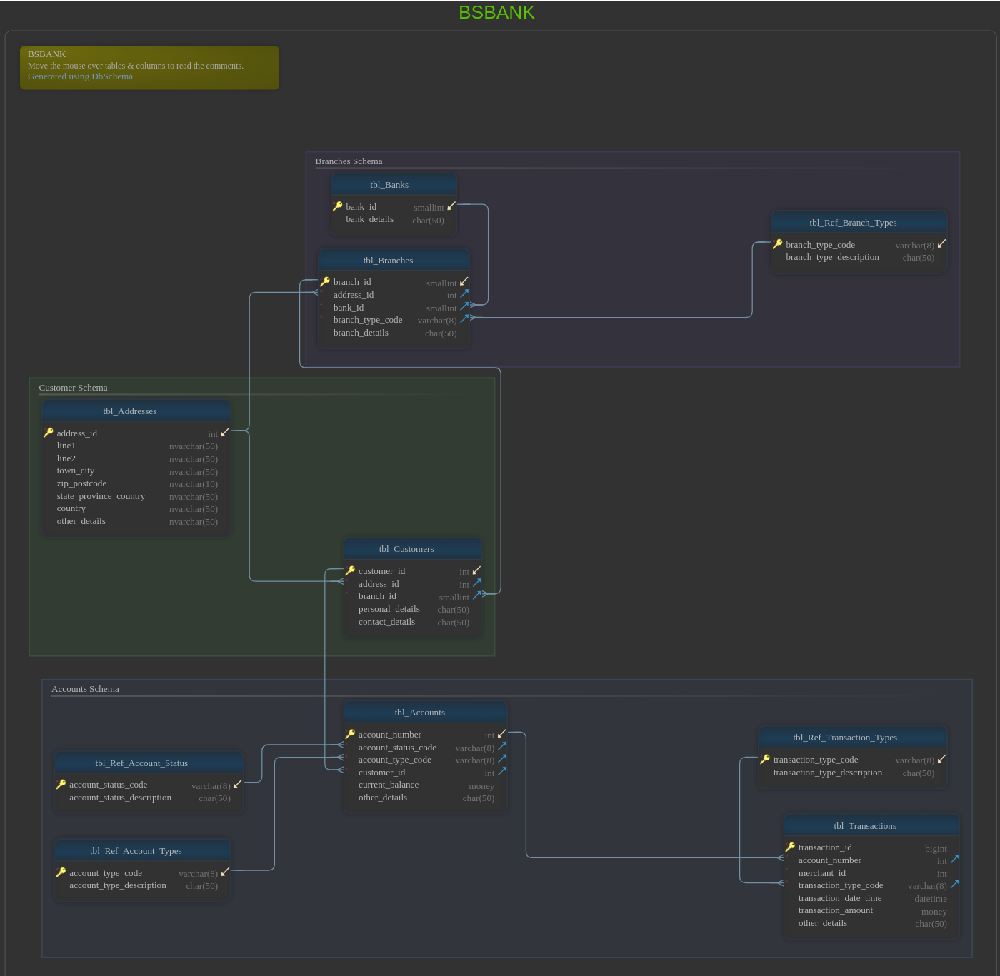

# NextGen Bank: SQL Database Design Practice
[](https://htmlpreview.github.io/?https://github.com/edunseng/fintech-tsql-dbdesign-practice/blob/master/db-diagrams/BSBANK.html)
[View BSBANK Database Diagram](https://htmlpreview.github.io/?https://github.com/edunseng/fintech-tsql-dbdesign-practice/blob/master/db-diagrams/BSBANK.html)
## Overview

NextGen Bank is a practice project designed to demonstrate the creation and management of a banking system's database using T-SQL. This repository contains all the necessary scripts and documentation for setting up, managing, and understanding the database structure.

## Table of Contents

- [Introduction](#introduction)
- [Getting Started](#getting-started)
- [Features](#features)
- [Directory Structure](#directory-structure)
- [Database Creation](#database-creation)
- [Contributing](#contributing)
- [License](#license)

## Introduction

The NextGen Bank project simulates a banking application's backend database. It provides a hands-on approach to learning database design principles, T-SQL scripting, and SQL Server features.

## Getting Started

To begin working with the NextGen Bank project:

1. Clone the repository to your local machine:
   ```bash
   git clone https://github.com/edunseng/fintech-tsql-dbdesign-practice.git
   ```
2. Navigate to the `sql-scripts` directory to find all the SQL scripts needed for the database setup:
   ```bash
   cd NextGen-Bank/sql-scripts/
   ```

## Features

- Comprehensive SQL scripts for database creation and schema definition.
- Detailed reports on test data loading processes.
- Visual diagrams representing the database architecture.

## Directory Structure

- `db-diagrams/`: Contains visual representations of the database structure, such as ER diagrams or schema layouts.
- `load-reports/`: Includes reports detailing the volume and results of test data loaded into the database.
- `sql-scripts/`: Holds SQL scripts for creating the database, tables, relationships, and other structural components.

## Database Creation

To create the NextGen Bank database, follow these steps:

1. Run `create_database.sql` to initialize the database with the necessary settings and filegroups.
2. Execute `create_table_structure.sql` to create the database schemas, tables, and associated structures.
3. Use `create_relations.sql` to define the relationships between tables, ensuring referential integrity and enabling complex queries.

Each script serves a specific purpose:

- `create_database.sql`: Sets up the initial database, defining its name, settings, and filegroup configurations.
- `create_table_structure.sql`: Constructs the database schema, including the creation of tables and their respective columns, data types, and constraints.
- `create_relations.sql`: Establishes foreign key constraints to link related tables, which is crucial for maintaining data consistency across the database.
- `remove_relations.sql`: Provides a way to remove all established relationships, useful during the restructuring or teardown of the database.
- `createsymlink_server.bat`: Automates the creation of symbolic links for SQL Server filegroups, facilitating better organization and management of database files on the server.

## Contributing

Your contributions are welcome! If you have suggestions for enhancements or additional features, please fork the repository, make your changes, and submit a pull request.

## License

This project is licensed under the MIT License - see the [LICENSE](LICENSE) file for more details.

---
For practical experience, you can restore the database from the provided [backup file](https://github.com/edunseng/fintech-tsql-dbdesign-practice/blob/main/BSBANK.bak).
